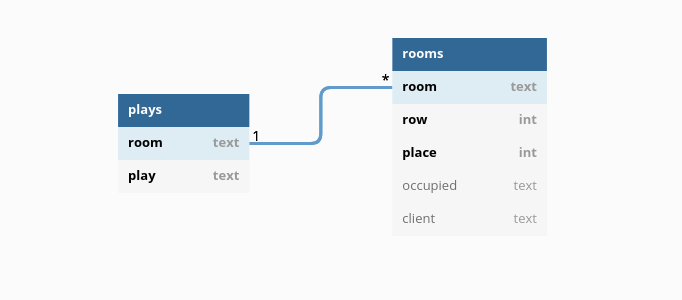

# Theater ticket booker

This project utilizes Cassandra database to run theater booking system.
In this system a client books some place at a given play of his/her interests.
Theater consists of 6 rooms (That's a BIG theater) so there can be 6 plays played simultanously.
Each room consists of 12 rows and 10 places at each row, so each room can contain 120 clients.
In total there can be 6*120 places booked. (720)

Database consists of 2 tables:
 1) **plays** (storing data about currently available spectacles)
  - room: room identifer
  - play: title of spectacle
 2) **rooms** (storing data about the state of each room (occupancy))
  - room: room identifier
  - row: row number
  - place: place/column number
  - occupied: no/yes -> occupation identifier
  - client: client identifier (who booked given place)

As I believe the problem is read-heavy (not all clients will buy the ticket, but all would like to see available places) I used LeveledCompactionStrategy which is recommended in such case. Also having in mind the rule:
 - `[read-consistency-level] + [write-consistency-level] > [replication-factor]`
I decided to set read-consistency-level to high and write-consistency-level to low value (assuming 3 nodes that would be 3 and 1 respectively)

To run the project:
1) Copy the content of `cluster_start` and run it in bash terminal to start the cluster and its nodes (using docker)
2) Run `pip install -r requirements.txt` to install required packages
3) Initialize the database with `python initial.py`. You can also use it to roll back database state to initial one (empty)
4) To run a client write `python main.py "Unique_client_name"` eg: `python main.py Jaroslaw`
5) Enjoy

+ To run some stress tests see files: stress_1.py, stress_2.py, stress_3.py

Problems:

1) Running more than 2 nodes on my equipment caused running out of memory problems (My laptop has 16GB RAM and 2 nodes run in docker containers + additionall system services consume 15 GB already (around 5GB for each node)) -> Any tries to limit memory consumption failed:
 - limiting docker container max RAM -> node crashes
2) Stress tests I intended to run with `cassandra-stress` didn't succeded -> problem with "Failed to connect over JMX; not collecting these stats" Trying to install JMX and configuring it didn't bring any improvement and the Internet stays silent in this matter.
3) Another try, I considered `nosqlbench` but when trying to run tests after some time the tool crashes.
<<<<<<< HEAD

Great thanks to authors of tutorials:
 - https://www.freecodecamp.org/news/the-apache-cassandra-beginner-tutorial/#how-to-set-up-a-cassandra-cluster
 - https://docs.datastax.com/en/developer/python-driver/3.25/getting_started/
=======
>>>>>>> 4e00925f6a38a9b05bcbaea6488edc71ba045a12
